# Guide
The Crosschain bridge is an application (app) that enables users to transfer assets by depositing them into the asset bridge and minting wrapped tokens between **VeChain** and **Ethereum**.

## Prerequisite
- You will need an Ethereum wallet, which can be obtained through ([MetaMask](https://metamask.io/download.html))
- You will also need a VeChain wallet, which can be acquired via  ([Sync2](https://sync.vecha.in))
- Ensure that you have a sufficient amount of assets to cover the transaction fee, which can be either ***Ether*** or ***VeThor***.

!>For the safety of your assets, it is crucial that you **immediately backup your wallet recovery (mnemonic) phrase**.

## Ledger User

### MetaMask <!-- {docsify-ignore} -->
**Step 1**. To connect your Ledger Nano to your computer device, use a USB cable to establish the connection. Additionally, open your MetaMask wallet in full screen on your browser.

    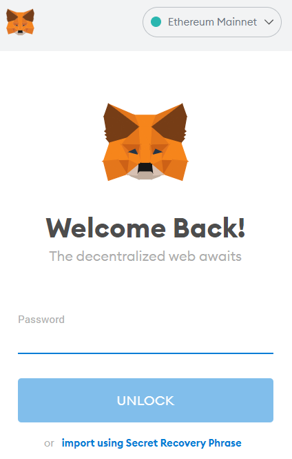

**Step 2**: To connect your hardware wallet to MetaMask, click on the top-right menu of the MetaMask wallet and select “Connect Hardware Wallet” in the drop-down menu.

    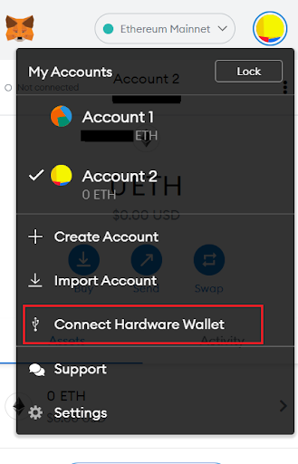

**Step 3**: Once you click "Continue," MetaMask will search for a connected Ledger device on your computer. To ensure that your wallet is discovered, make sure to unlock your Ledger device by entering the PIN code. This will allow MetaMask to access your wallet's information

    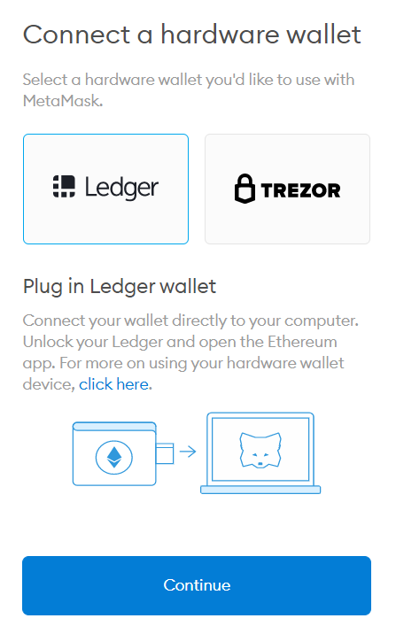

!> Ledger official **strongly recommend** using MetaMask with the *Firefox browser* because it does not require using the Ledger Live bridge.

**Step 4**: Once MetaMask discovers your connected Ledger wallet, it will prompt you to choose a Ledger account that you would like to connect to MetaMask. Select the account you prefer and complete the process. If you don't have an account on your Ledger device, you can create one directly from [Ledger Live](https://www.ledger.com/academy/the-power-of-ledger-live). After selecting the account, you will be able to use MetaMask with your Ledger device securely.

**Step 5**:  Some last steps to make sure everything runs smoothly.

1. Click on the “Ethereum application” on your hardware wallet display then click on “settings” and turn on “blind signing” (please make sure you’re aware of the risks associated with blind signing). Or else it won’t work properly. 
2. Open the MetaMask window, click on the account logo on the top right corner, scroll down to “settings” and click. Then click “advanced settings”, scroll down and turn on “use with Ledger Live”. 

?>If you’re having any trouble or feel a bit lost, this [support page](https://support.ledger.com/hc/en-us/articles/360020871157-Connection-issues-with-MetaMask-?support=true) might be of help.

### Sync2 <!-- {docsify-ignore} -->
**Step 1**. Connect your Ledger Nano to your computer device using a USB cable.

**Step 2**: Click upper left  to open wallet list

    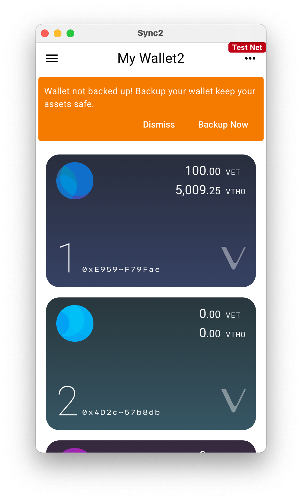

**Step 3**: Click the upper area  to new wallet page

    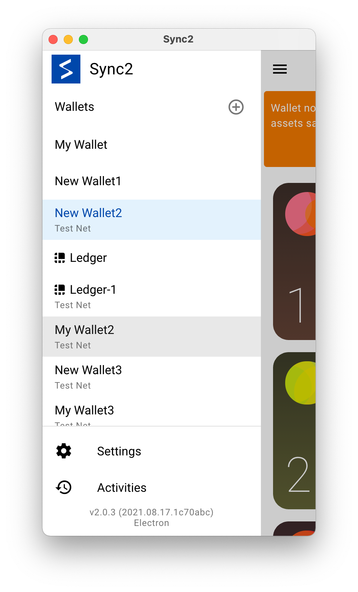

**Step 4**: Click **Link Now**

    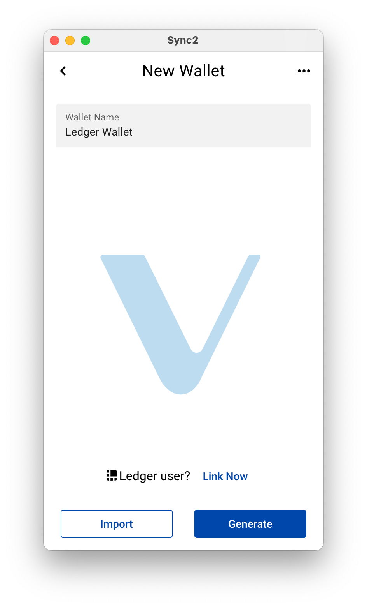

**Step 5**: Connect and unlocked your Ledger device

    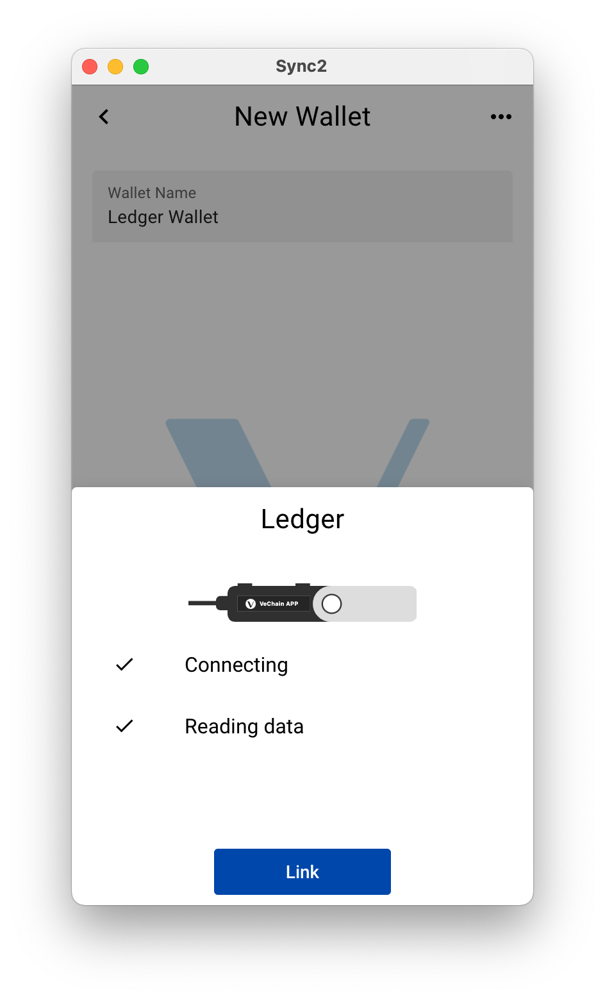

**Step 6**:. Click **Link**

?>If you're experiencing any difficulties or feeling unsure, the following links may be helpful:[Link Ledger device](https://docs.vechain.org/sync2/user-guide/wallet.html#link-ledger-device) / [Ledger troubleshoots](https://docs.vechain.org/sync2/faq.html#ledger-troubleshoots)

## Switch Account
If you have multiple accounts in MetaMask/Sync and need to switch from one to another, please follow this procedure:

### MetaMask <!-- {docsify-ignore} -->
- **MetaMask Extension**: Click on the round favicon icon in the top right corner. You will find a list of accounts; click on each of them for details.
- **MetaMask Mobile app**: click on the 3 horizontal lines icon on top left of the app. Click on the drop down arrow next to "Account", and choose from the list of accounts the one you would like to use.

### Sync2 <!-- {docsify-ignore} -->
- Click on upper right account button; click **Disconnect** ; Click **Connect** and it will prompt and request the certificate; click the sign or choose from the list of accounts the one you would like to use.

## Bridge

**Step 1**. Choose a network to transfer your assets from the source chain (Ethereum or VeChain).

?>**Source Chain**: The current blockchain where your funds are located and that you want to bridge.

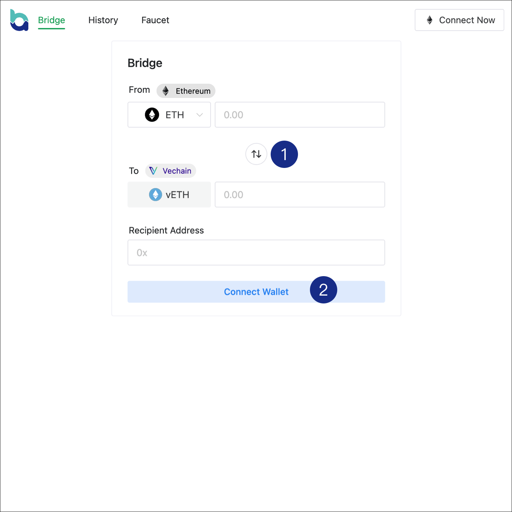

**Step 2**. Connect to your wallet to proceed with the asset transfer.

**Step 3**. Select the asset that you wish to transfer.

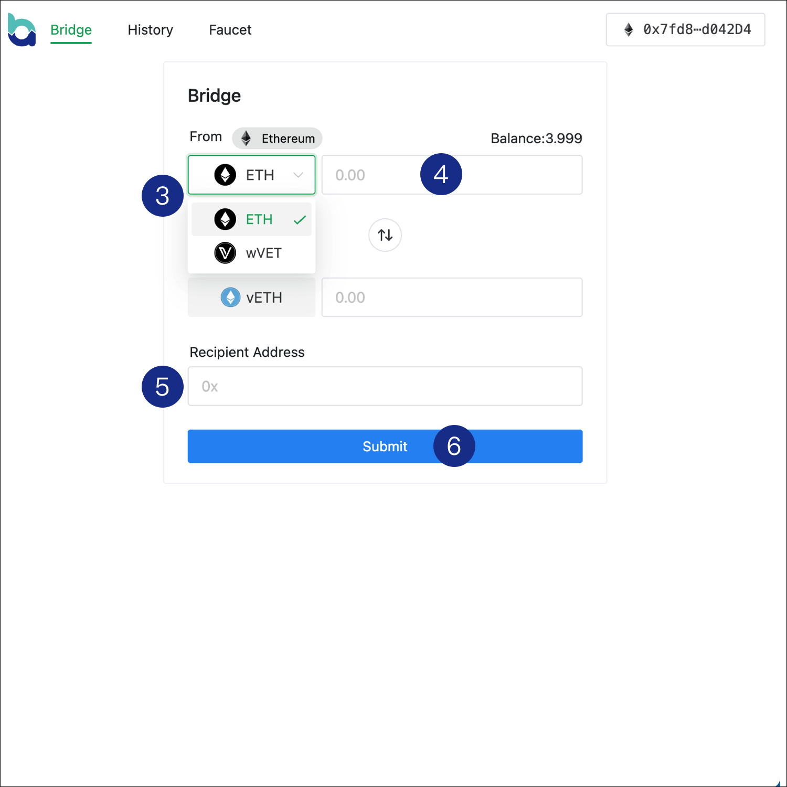

**Step 4**. Input the amount you want to transfer.

**Step 5**. Input or paste the receiver address on the destination chain.

?>**Destination chain**: The blockchain where you want to receive the tokens.

**Step 6**. Click **Swap** to initiate the transfer of your asset. 

?>The Crosschain Fee is 0.00%, with no minimum amount required; The maximum Crosschain Fee is also 0.00 ETH/VET.; The Estimated Time of Crosschain Arrival is approximately 10-30 minutes.

**Step 7**.Sign the transaction on your wallet (Metamask/Sync2).

**Step 8**. Wait for the finalization and the asset bridge to process your request.

>Estimated Time of Crosschain Arrival is up to 30 minutes. The actual time may vary depending on the asset bridge's packing cycle.

>After the bridge packing is completed, you will need to manually claim the token by using the "claim" function.

## History
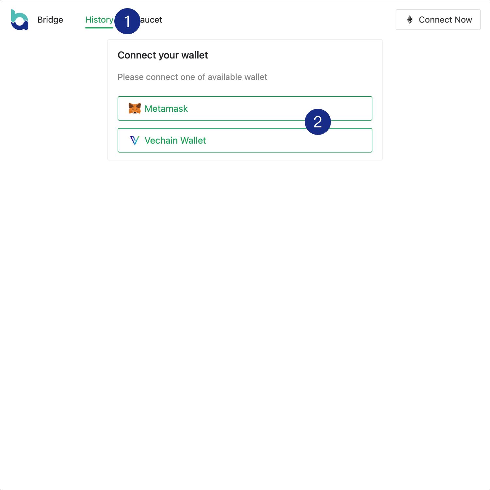

?> If you are already logged in, please ignore **Step 1** and **Step 2**. You can proceed directly to the following steps.

**Step 1**. Click on History to claim the swapped tokens.

**Step 2**. Connect to the appropriate wallet based on the source of the asset: 

>If you are receiving the asset from **Ethereum**, please connect to **Sync2**.

>If you are receiving the asset from **VeChain**, please connect to **MetaMask**.

**Step 3**. Click on **Claim** and wait for the wallet prompt to complete the process.
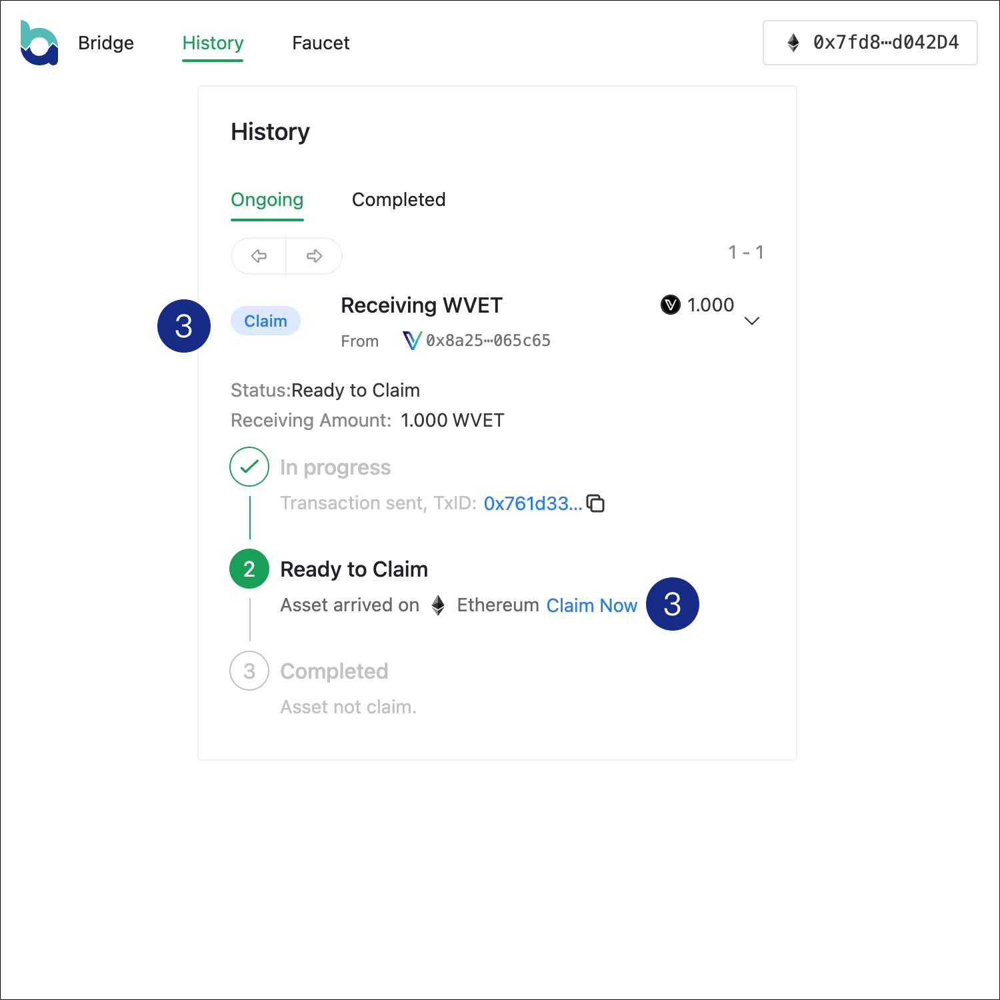

**Step 4**. Sign the transaction on your wallet (Metamask/Sync2) to complete the claim process.

## FAQ
### Packing in progress
"Packing in progress" indicates that the service is currently preparing the crosschain bridge packing and transferring your requested asset to the destination chain.

### How long does bridge packing take ?

Estimated Time of asset arrival is up to 30 mins

### What coins and tokens will be supported?

Currently there are two pairs on each chain **Ethereum** and **VeChain**. 

- ETH <> vETH
- VET <> wVET

### Why I need to sign transaction twice (approve & transfer) when I transferring wVET?
This is because of the ERC20 approve function used by DApps, including DeFi Swap, which requires two separate transactions to gain permission for transferring a certain amount of tokens. The first transaction (approve) is a security measure for ERC20 token holders, allowing the smart contract to execute transactions on their behalf. After completing the approval, you will be able to proceed with confirming the actual transfer transaction. This process ensures enhanced security and control over the token transfer.

VeChain utilizes a multi-clause feature, which streamlines the process. As a result, users only need to sign one transaction that includes both the approval and transfer steps when signing the transaction. This simplifies the process and provides a more user-friendly experience.

### Cant connect  Ledger device on Metamask 
Please review this list carefully then try connecting your Ledger device to MetaMask again.

- Ledger official **strongly recommend** using MetaMask with the *Firefox browser* because it does not require using the Ledger Live bridge.
- Ensure that **MetaMask is up to date**. More on this [here](https://MetaMask.zendesk.com/hc/en-us/articles/360060268452-How-to-update-the-version-of-MetaMask).
- Ensure that **Ledger Live is closed** otherwise it might prevent your Ledger device from connecting to MetaMask.
- Open the Ethereum app on your Ledger device **before** clicking the **"Connect Hardware Wallet"** button in MetaMask.
- Ensure that your Ledger device **runs the latest firmware version.** You can learn more [here](https://support.ledger.com/hc/en-us/articles/360002731113-Update-Ledger-Nano-S-firmware?docs=true) (Nano S users) or [here](https://support.Ledger.com/hc/en-us/articles/360013349800-Update-Ledger-Nano-X-firmware?docs=true) (Nano X users).
- Ensure that your Ledger device is **running the latest version of the Ethereum (ETH) app.** Learn more [here](https://support.Ledger.com/hc/en-us/articles/360009576554-Ethereum-ETH-?docs=true).
- Ensure that **blind signing is enabled** ([Blind Signing](https://support.Ledger.com/hc/en-us/articles/4405481324433-Enable-blind-signing-in-the-Ethereum-ETH-app?docs=true) was formerly called *Contract Data*. Please note that Contract Data and Blind Signing are the same feature, only the name has changed.) in the Ethereum app **settings** on your Ledger device. Learn more [here](https://support.Ledger.com/hc/en-us/articles/4405481324433-Enable-blind-signing-in-the-Ethereum-ETH-app?docs=true).
